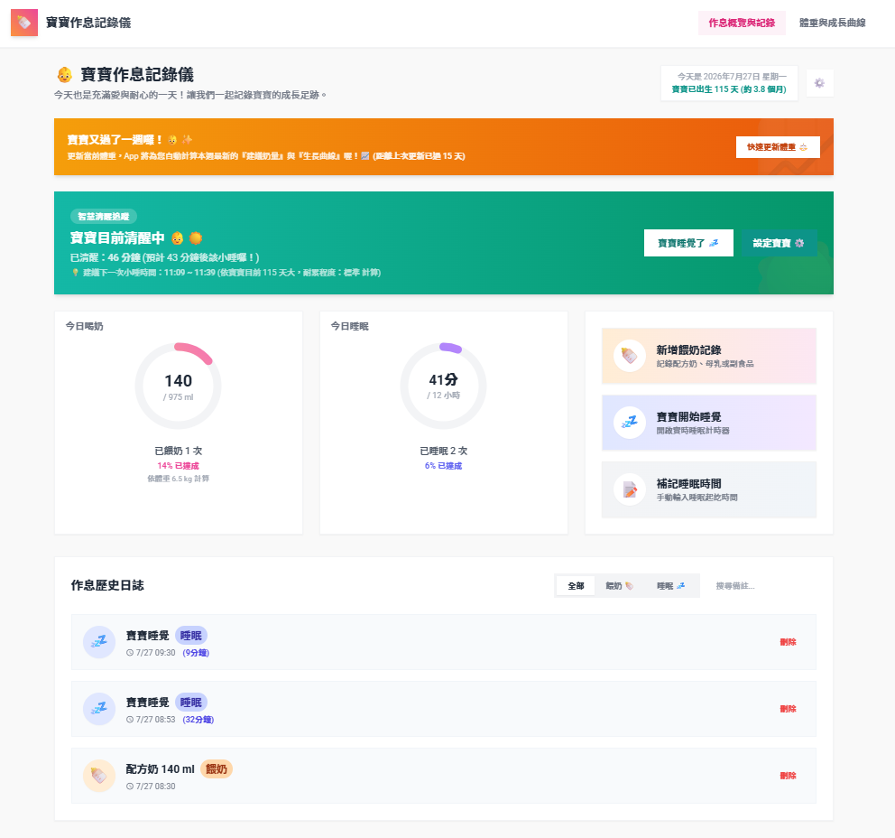
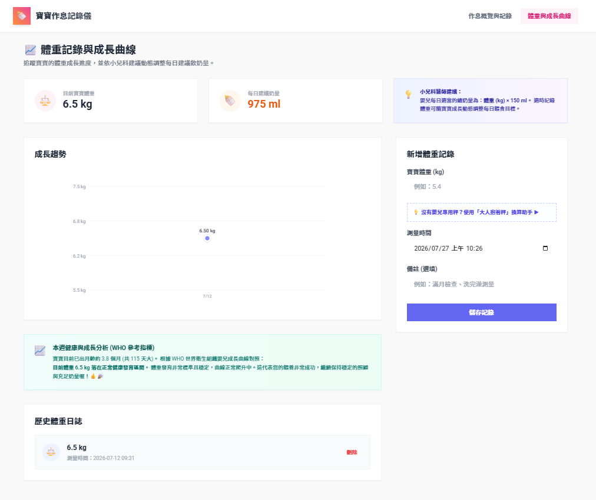

# 👶 寶寶作息記錄儀 (Baby Tracker)

這是一個專為父母設計的純前端嬰兒作息記錄器。旨在提供一個優雅、溫馨且流暢的介面，幫助父母隨手記錄與追蹤嬰兒的**喝奶量**與**睡眠作息**。

本專案採用 **Vue 3 (Composition API) + Vite + TailwindCSS** 開發，並整合了 **Vuetify** 進行元件開發與排版。

## 📱 系統畫面預覽 (UI Previews)

<p align="center">
  
  &nbsp;&nbsp;
  
</p>

---

## ✨ 核心特色

- **🍼 智能餵奶記錄**
  - 支援配方奶、母乳瓶餵、母乳親餵與副食品記錄。
  - 針對母乳親餵，貼心提供左右乳房親餵時間的分開記錄（哺乳媽媽必備！）。
  - 提供快捷奶量按鈕，一鍵輸入常用毫升數。

- **💤 實時睡眠計時器與智慧清醒追蹤**
  - 首頁一鍵點擊「寶寶開始睡覺」啟動計時器，動態更新入睡時長；醒來時點擊「寶寶醒了」自動帶入時間。
  - **智慧小睡預測**：當寶寶清醒時，系統會自動在首頁顯示寶寶已清醒時長，並根據**月齡自動調整**（0~12個月以上不同發育階段）建議的清醒極限區間。
  - **個體化疲憊耐受度微調**：提供「容易累」、「標準」、「較耐累」三種耐受度設定，智慧校正推薦的下一次小睡黃金時機，防範寶寶過累鬧脾氣。

- **📸 拍照留念與影像記錄**
  - 調用網頁視訊鏡頭（Web Camera）或呼叫手機原生相機直接進行拍照。
  - 前端自動進行圖片壓縮與縮小，防止瀏覽器記憶體與儲存負載。
  - 相片數據儲存於瀏覽器當地的 **IndexedDB**，即使重新整理或離線使用，相片也不會遺失！

- **📊 視覺化今日統計**
  - 採用溫馨配色與 SVG 動態圓環進度條展示今日累計喝奶量與睡眠時長。
  - 協助快速掌握寶寶今天的作息與達成率是否達標。

- **📈 體重記錄、生長曲線與智慧助推器**
  - **每週自動提醒更新**：距離上次體重記錄超過 7 天時，系統會自動在首頁彈出溫馨的提醒橫幅，預防數據過期。
  - **大人抱秤相減助手**：貼心解決家裡沒有嬰兒專用秤的痛點！只需輸入「大人抱寶寶重」和「大人單獨重」，系統會自動換算寶寶體重，一鍵填入。
  - **WHO 發育指標健康評估**：設定寶寶生日後，App 自動對比 WHO 官方標準成長百分位，提供溫馨且客觀的發育回饋，極大地緩解新手爸媽的育兒焦慮。
  - **科學化動態奶量目標**：依小兒科醫師建議之公式（體重 kg × 150 ml）自動計算每日建議總奶量，並即時更新首頁的喝奶進度與每餐建議量。

- **🔍 歷史日誌與搜尋篩選 (RWD 體驗升級！)**
  - **首頁精簡展示**：首頁僅保留最近 5 筆最新的作息記錄，使行動端介面清爽俐落、載入迅速。
  - **專屬歷史頁籤**：提供獨立的完整歷史日誌頁籤（點擊首頁「查看完整歷史日誌」或利用底部導覽列切換）。
  - **完整篩選與搜尋**：支援在專屬頁籤內按照「全部」、「餵奶」、「睡眠」進行類別篩選，以及依備註關鍵字搜尋。
  - 支援點擊相片縮圖展開大圖檢視，並可隨時刪除錯誤記錄。

- **🎙️ 語音智慧記錄 (新功能！)**
  - 透過瀏覽器原生 Web Speech API 實現免設定的語音辨識，安全且完全免費。
  - **行動端優化體驗**：支援 Haptic 物理輕震回饋、手機版 Bottom Sheet 底部抽屜版型、**高質感手機底部導覽列 (Bottom Navigation Bar)** 以解決手機版面切換痛點，以及加大 touch targets 防呆微調。
  - **口語指令解析**：智慧辨識「餵奶 120cc」、「睡了半小時」、「親餵左邊十分鐘」等，自動將口語中文數字轉換並生成結構化作息記錄。

---

## 🛠️ 開發與建置指令

在專案目錄下，您可以使用以下指令來運行或測試專案：

- **啟動開發環境**:
  ```bash
  npm run dev
  ```
  啟動後，在瀏覽器開啟 `http://localhost:5173` 即可使用。

- **專案構建 (Build)**:
  ```bash
  npm run build
  ```
  構建完成後，會生成 `dist` 資料夾，即可佈署到任何靜態網站主機（例如 GitHub Pages、Vercel、Netlify 等）。

- **類型檢查**:
  ```bash
  npm run type-check
  ```

- **程式碼 Lint 檢查**:
  ```bash
  npm run lint
  ```

- **單元測試**:
  ```bash
  npm run test:unit
  ```
  執行 Vitest 進行單元測試。我們已經為 IndexedDB 儲存與首頁載入邏輯編寫了單元測試。

---

## 📂 專案架構說明

主要的核心程式碼位於以下路徑：

- [src/views/Dashboard/Overview.vue](file:///D:/Projects/baby-tracker/src/views/Dashboard/Overview.vue) - 作息記錄的主控面板 (Dashboard) 與對話框邏輯。
- [src/components/VoiceRecordDialog.vue](file:///D:/Projects/baby-tracker/src/components/VoiceRecordDialog.vue) - 語音錄音與行動端優化 UI 的智慧對話盒元件。
- [src/helpers/voiceParser.js](file:///D:/Projects/baby-tracker/src/helpers/voiceParser.js) - 智慧口語指令解析器，支援中文數字與睡眠、餵奶時長提取。
- [src/views/Dashboard/Growth.vue](file:///D:/Projects/baby-tracker/src/views/Dashboard/Growth.vue) - 體重記錄與 SVG 成長曲線趨勢頁面。
- [src/components/CameraPicker.vue](file:///D:/Projects/baby-tracker/src/components/CameraPicker.vue) - 結合 Web Cam 與原生拍照的相機選擇器元件，支援前端圖片縮圖壓縮。
- [src/helpers/db.js](file:///D:/Projects/baby-tracker/src/helpers/db.js) - 基於 Promise 的 IndexedDB 儲存封裝，並提供 localStorage/記憶體降級 fallback，以確保離線與單元測試環境穩定運行。
- [test/unit/helpers/voiceParser.spec.js](file:///D:/Projects/baby-tracker/test/unit/helpers/voiceParser.spec.js) - 語音解析器的 13 項自然語言單元測試。
- [test/unit/helpers/db.spec.js](file:///D:/Projects/baby-tracker/test/unit/helpers/db.spec.js) - 針對 IndexedDB 封裝的 CRUD 單元測試。
- [test/unit/SampleMain.spec.js](file:///D:/Projects/baby-tracker/test/unit/SampleMain.spec.js) - 針對主控面板渲染與基本文字的單元測試。

---

## 🚀 雲端快速部署指南 (適合其它家長架設，完全免費)

如果您想將這個好用的工具分享給其他新手爸媽，他們不需要懂任何程式碼，只要完成以下兩個步驟，即可建立出個人專屬、跨裝置同步的線上寶寶作息記錄儀！

---

### 第一步：建立免費的 Supabase 資料庫

為了儲存您和家人（多個裝置）的作息記錄，請先建立您的專屬雲端資料庫：

1. **註冊帳號**：前往 [Supabase 官網 (supabase.com)](https://supabase.com/) 點選 **Sign Up**。使用您的 GitHub 帳號一鍵登入即可。
2. **建立新專案**：
   - 點選 **New Project**。
   - 設定專案名稱（例如：`my-baby-tracker`）。
   - 設定一個安全的資料庫密碼（請先記在備忘錄中）。
   - 區域（Region）選擇離您最近的地方（例如：亞洲選 `Singapore` 或 `Tokyo`）。
   - 點選 **Create new project**，等待約 1-2 分鐘資料庫建立完成。
3. **建立資料表 (Records Table)**：
   - 專案建立完成後，在左側選單中點選 **SQL Editor**（一個像大於 `>` 符號的圖示）。
   - 點選右上角的 **New query** 按鈕建立一個新輸入視窗。
   - 複製此專案根目錄下 [supabase_schema.sql](file:///D:/Projects/baby-tracker/supabase_schema.sql) 檔案裡面的所有 SQL 程式碼。
   - 將程式碼貼入 Supabase 網頁的編輯器中，點選右下角的 **Run** 按鈕。
   - 看到綠色的 `Success` 提示即代表資料表與即時同步政策已成功建立！
4. **取得金鑰資訊**：
   - 點選左下角的 **Project Settings**（齒輪圖示） > **API**。
   - 複製以下兩個重要金鑰以備在第二步使用：
     - **Project URL**（對應 Vercel 中的 `VITE_SUPABASE_URL`）
     - **anon public** (對應 Vercel 中的 `VITE_SUPABASE_ANON_KEY`)

---

### 第二步：一鍵部署至 Vercel

請點選下方的 **「Deploy to Vercel」** 按鈕，系統會自動在您的 GitHub 帳號下複製（Fork）該專案並完成線上部署發佈：

[](https://vercel.com/new/clone?repository-url=https%3A%2F%2Fgithub.com%2Fse795646%2Fbaby-care-tracker&env=VITE_SUPABASE_URL,VITE_SUPABASE_ANON_KEY)

1. **點擊上方按鈕**，登入您的 Vercel 帳號（直接用 GitHub 帳號登入）。
2. 在 **Create Git Repository** 欄位中，設定您複製過去的儲存庫名稱（可選擇勾選 **Create private Git Repository**，將網頁代碼設為私有以保護代碼隱私）。
3. 展開下方 **Environment Variables**（環境變數）摺疊選單，填入您在第一步取得的兩個數值：
   - `VITE_SUPABASE_URL` : 貼上您的 Supabase Project URL。
   - `VITE_SUPABASE_ANON_KEY` : 貼上您的 Supabase anon public 金鑰。
4. 點選下方的 **Create** 鈕開始部署。大約等候 1 分鐘，當網頁出現滿天五彩紙花特效時，代表您的專屬網站已經架設完畢！
5. 點選預覽圖即可進入您的專屬作息記錄儀（例如：`https://your-project.vercel.app`），將網址加入手機桌面即可當作 App 隨時使用。

> ⚠️ **貼心提醒 (若未來修改金鑰)**：
> 由於安全機制，連線金鑰是在打包時「包進」網頁中的。若您未來在 Vercel 更改了上述的變數值，請務必到 Vercel 該專案控制台的 **Deployments** 頁面，點選最新一次部署右側的三個點 `...`，再點選 **Redeploy**，新設定才會生效。

---

## 🛠️ 自訂修改：進階開發與本機建置指南

如果您想要自訂修改網頁代碼（例如調整 UI 配色、新增記錄欄位），在專案公開後，您不需要手動拷貝檔案，可以直接採取標準的開源協作流程：

### 1. 取得程式碼進行本機開發
1. **Fork 或 Clone 專案**：
   - 點選專案右上角的 **`Fork`** 按鈕，將專案複製一份到您個人的 GitHub 帳號下。
   - 或者，您也可以到本儲存庫右側的 **`Releases`** 頁面，直接下載最新發佈版（如 `v1.0.0`）的原始碼壓縮檔（Source code.zip）。
2. **本機執行**：
   - 下載或 Clone 至本機後，在專案目錄下執行 `npm install` 安裝依賴套件。
   - 複製 `.env.example` 並命名為 `.env`，填入您的 Supabase 專案金鑰。
   - 執行 `npm run dev` 啟動本機開發伺服器，在瀏覽器開啟 `http://localhost:5173` 即可進行開發與測試。

### 2. 手動部署至 GitHub Pages (替代託管方案)
1. 在 `vite.config.js` 中，將 `base` 修改為您的 GitHub 專案名稱（例如：`base: '/baby-care-tracker/'`）。
2. 可利用 `gh-pages` npm 套件，或設定 GitHub Actions 自動將編譯產出的 `dist` 靜態檔案部署至 `gh-pages` 分支。
